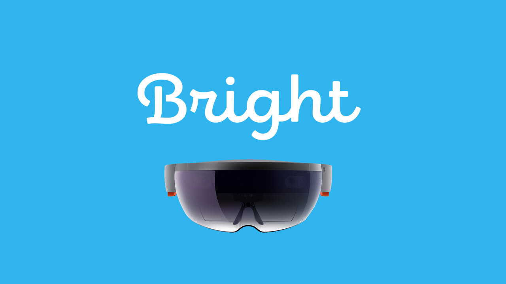

# Bright

## Description

According to the WHO, over 250 million people around the world suffer from moderate to severe vision loss, 81% of whom are above the age of 50. Many face significant challenges in daily life. Some of the leading solutions for a variety of vision impairments are extremely expensive headsets that essentially provide a zoomed-in view of the world.

Bright is a seed to make faces familiar again and everyday challenges manageable.

Bright runs as an app on Microsoft HoloLens and allows users to zoom in to a customizable level, hear written text (e.g. books, newspapers, documents, TV) as spoken speech, recognize other people nearby (giving names for stored people, and age/gender/emotion estimates for others), and contact others in the case of an emergency.

We built our solution in Unity, implementing various services from Microsoft’s Azure Cognitive Services and Twilio for phone calls.

## Team Members

Ashish Bakshi, Cesar de Castro, Andreas Dias, Jan Simson, Charlene Yu

## Development

We used:

Platform: Microsoft Hololens / Universal Windows Platform  
Development Tools: Microsoft Visual Studio 2017, Unity, Github  
SDKs: Windows SDK  
APIs: Microsoft Azure Cognitive Services, Twilio  
Components used not created at hackathon: Mixed Reality Toolkit, [Wontonst Twilio SMS on Unity](https://github.com/wontonst/twilio-sms-unity).  
Assets: None  
